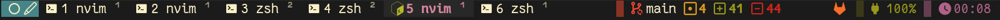
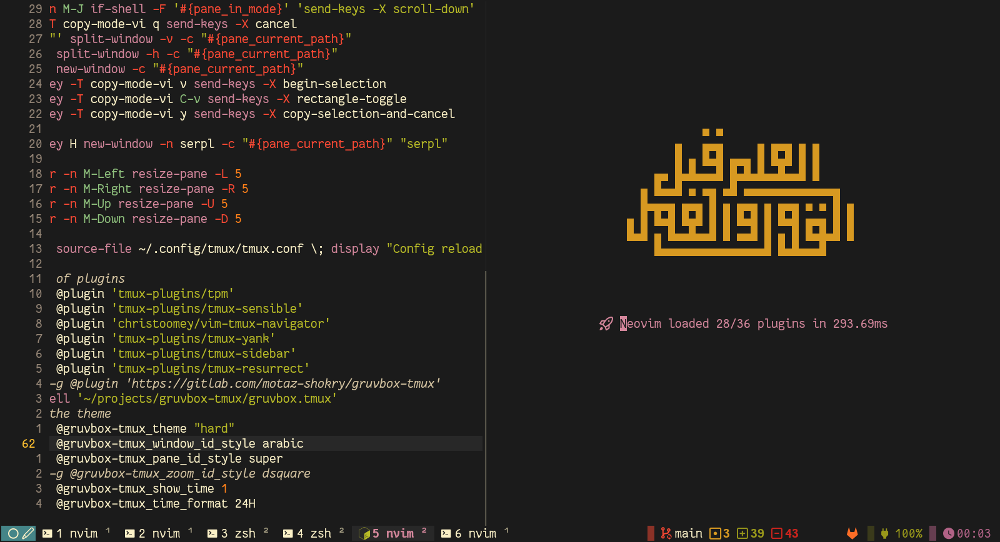
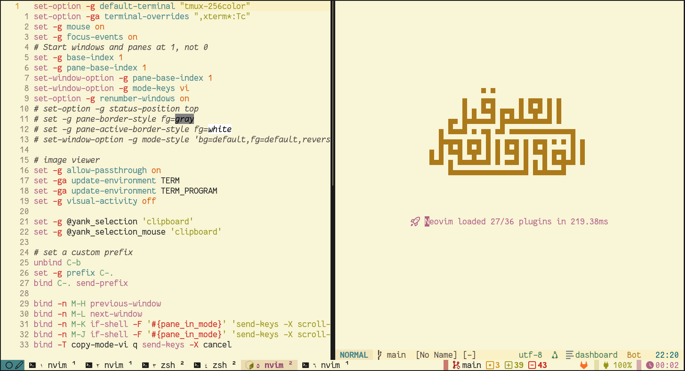

# Flavors Tmux



**Flavors Tmux** is a clean, multi-palette tmux theme with Nerd Font icons,
semantic colors, and optional status widgets for Git, GitHub/GitLab, battery,
and time.

It started from a Gruvbox-inspired style and now includes several familiar
flavors: Gruvbox Hard, Medium, Soft, Light, Tokyo Night, Catppuccin, Dracula,
Nord, GitHub Dark, One Dark, Solarized Dark, Solarized Light, Monokai,
GitHub Light, Ayu Dark, Ayu Light, Flexoki Dark, and Flexoki Light.

## Features

- Eighteen built-in color flavors
- Optional transparent status bar background
- Git branch, change, insert, delete, untracked, push, and pull indicators
- Optional GitHub/GitLab widget for pull requests, reviews, issues, and bugs
- Optional battery widget with charging/discharging icons
- Configurable 12-hour, 24-hour, or hidden time widget
- Custom window, pane, and zoom number styles
- Custom terminal and active-terminal icons

## Requirements

Required:

- [tmux](https://github.com/tmux/tmux)
- [Bash](https://www.gnu.org/software/bash/)
- A [Nerd Font](https://www.nerdfonts.com/) for icon rendering

Recommended for full widget support:

- `git`
- `bc` for Git counters
- `jq` plus either `gh` or `glab` for GitHub/GitLab status widgets

Optional:

- [Zig](https://ziglang.org/) 0.16.0+ — builds a native binary for faster
  widgets (auto-detected by TPM and manual install)

## Installation

### TPM

Add the plugin to your `.tmux.conf`:

```tmux
set -g @plugin "Jacob-Valor/flavors-tmux"
```

Then press your TPM prefix followed by `I` to install.

> **Note:** If [Zig](https://ziglang.org/) is installed, TPM will automatically
> build the native binary on install and update for faster widget rendering.
> Without Zig, the plugin falls back to Bash scripts.

### Manual

Clone the repository and run the plugin from your `.tmux.conf`:

```sh
git clone https://github.com/Jacob-Valor/flavors-tmux ~/.tmux/plugins/flavors-tmux
```

```tmux
run-shell ~/.tmux/plugins/flavors-tmux/flavors.tmux
```

Reload tmux after installing:

```sh
tmux source-file ~/.tmux.conf
```

## Configuration

All options use the `@flavors-tmux_` prefix.

### Theme

```tmux
set -g @flavors-tmux_theme "hard"
set -g @flavors-tmux_transparent 0
```

Available themes:

- `hard`
- `medium`
- `soft`
- `light`
- `tokyonight`
- `catppuccin`
- `dracula`
- `nord`
- `github_dark`
- `onedark`
- `solarized_dark`
- `solarized_light`
- `monokai`
- `github_light`
- `ayu_dark`
- `ayu_light`
- `flexoki_dark`
- `flexoki_light`

Set `@flavors-tmux_transparent` to `1` to use your terminal background.

### Icons

```tmux
set -g @flavors-tmux_terminal_icon ""
set -g @flavors-tmux_active_terminal_icon ""
```

### Number styles

```tmux
set -g @flavors-tmux_window_id_style "hsquare"
set -g @flavors-tmux_pane_id_style "super"
set -g @flavors-tmux_zoom_id_style "dsquare"
```

Available styles:

- `arabic` — `0 1 2 3`
- `earabic` — Eastern Arabic numerals
- `fsquare` — filled square icons
- `hsquare` — hollow square icons
- `dsquare` — double square icons
- `super` — superscript numbers
- `sub` — subscript numbers
- `hide` — hide the number

## Widgets

### Time

The time widget is enabled by default.

```tmux
set -g @flavors-tmux_show_time 1
set -g @flavors-tmux_time_format "24H"
```

Available formats:

- `24H` — `18:30`
- `12H` — `06:30 PM`
- `hide` — hide only the time text

Disable the whole time widget:

```tmux
set -g @flavors-tmux_show_time 0
```

### Git

The Git widget is enabled by default and appears inside Git repositories.

```tmux
set -g @flavors-tmux_show_git 1
```

Disable it:

```tmux
set -g @flavors-tmux_show_git 0
```

### GitHub / GitLab

The forge widget is enabled by default when the current repository uses GitHub
or GitLab and the required CLI is available.

```tmux
set -g @flavors-tmux_show_wbg 1
```

Disable it:

```tmux
set -g @flavors-tmux_show_wbg 0
```

### Battery

The battery widget is disabled by default.

```tmux
set -g @flavors-tmux_show_battery_widget 1
set -g @flavors-tmux_battery_name "BAT0"
set -g @flavors-tmux_battery_low_threshold 20
```

On Linux, run this to find your battery name:

```sh
ls /sys/class/power_supply
```

## Screenshots

### Gruvbox Hard



### Gruvbox Light



## Inspiration

- [Gruvbox](https://github.com/morhetz/gruvbox)
- [Tokyo Night Tmux](https://github.com/janoamaral/tokyo-night-tmux)
